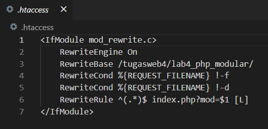
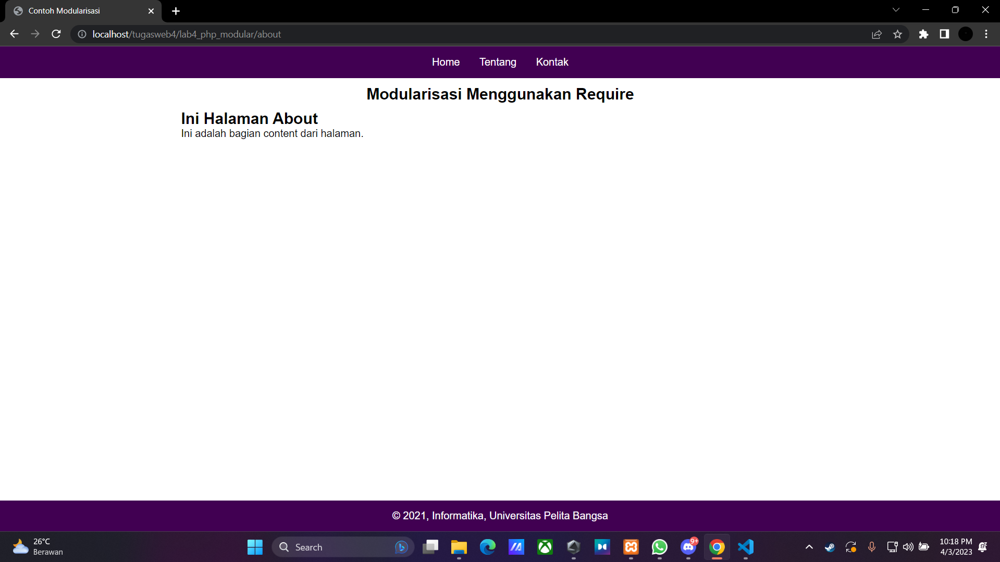
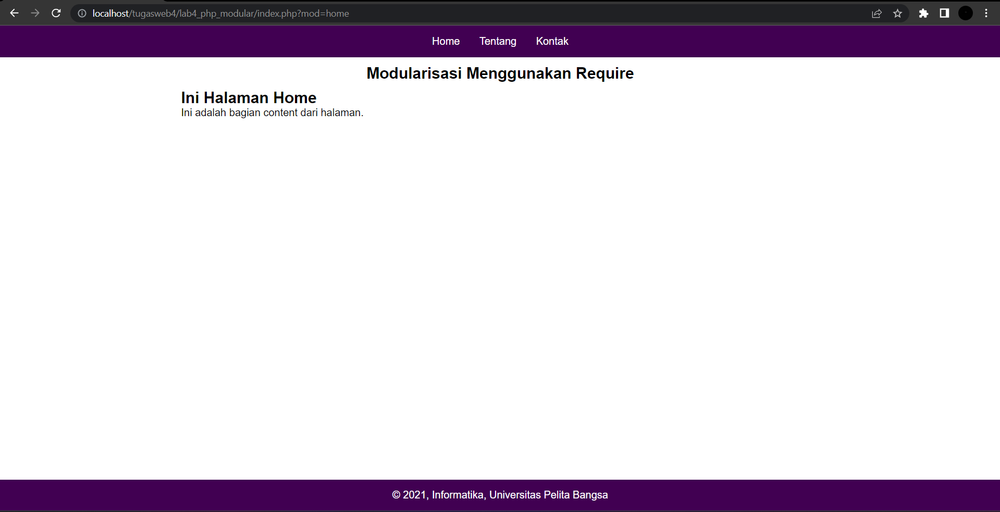
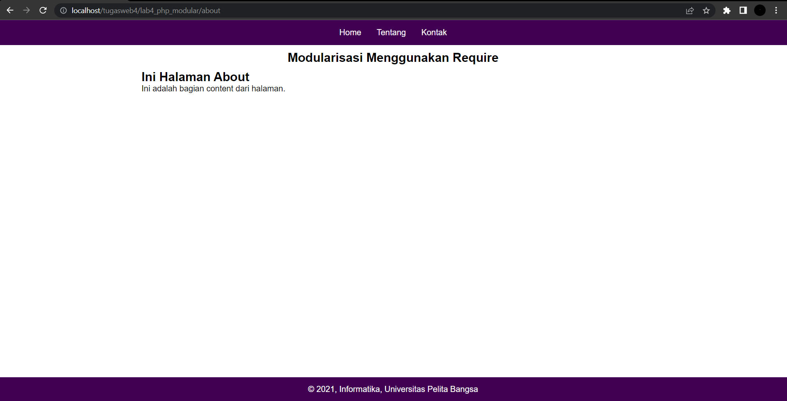
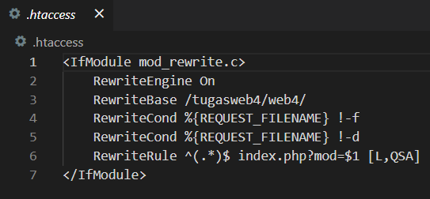
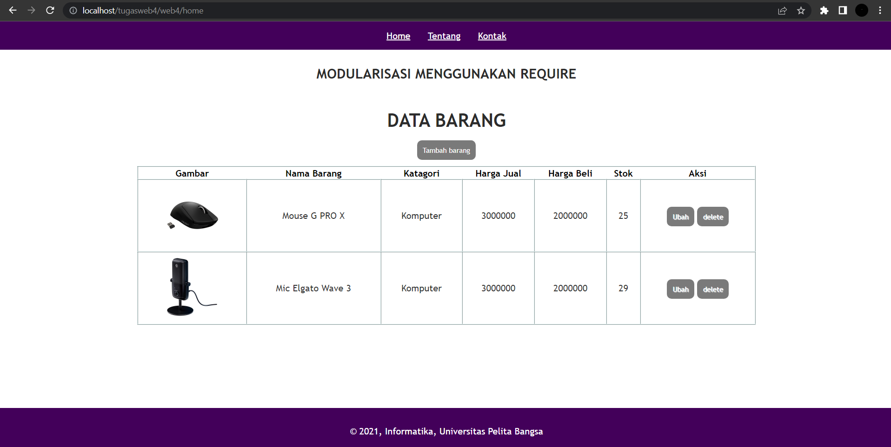
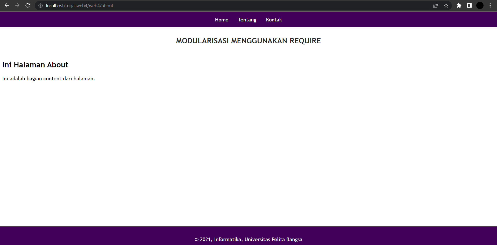
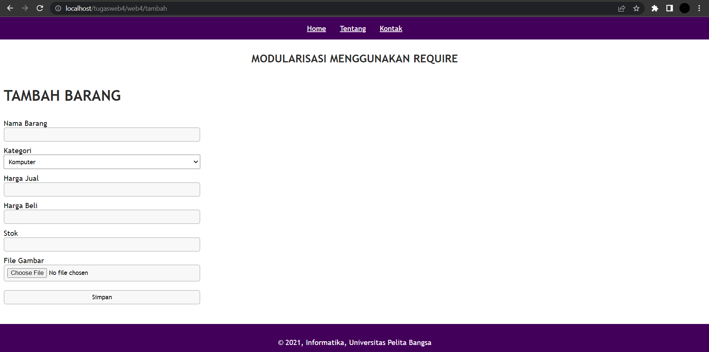
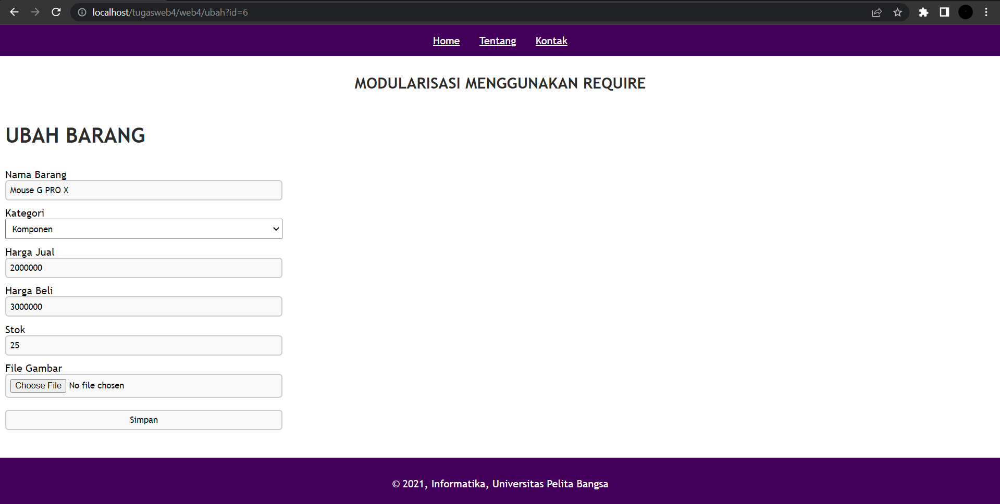

**
Nama: Delfian Ruly Havatilla
**
**
Kelas: TI.21.A.1
**
**
NIM: 312110161
**

<h1> Praktikum 4 (Pemrograman Web 2) </h1>

<h2> Konsep Modular </h2>

1. Tampilan ht.access modularisasi :

2. Tampilan Home :

3. Tampilan About :

4. Tampilan Contact :

5. Tampilan index.php?mod=home :

6. Tampilan /about :

<h2> Tugas Implementasikan Konsep Modularisasi Pada Kode Program Tugas Lab3Web </h2>

1. Tampilan ht.access tugas modularisasi :

2. Tampilan file web4 :

3. Tampilan about.php :

4. Tampilan tambah.php :

5. Tampilan ubah mengambil nomer id :

Sekian dan Terima Kasih
